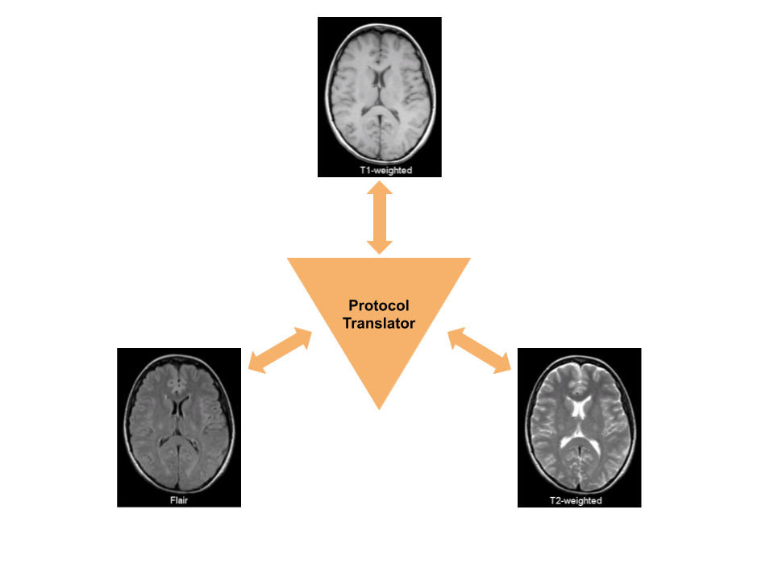

# Protocol Translation Using GAN

---

## Network Concept

Inspired by [StarGAN](https://arxiv.org/abs/1711.09020)

### Generator
- Input : Source image + Protocol vector
- Output : Generated Protocol image

### Discriminator
- Input : Protocol image
- Output : Real/Fake + Protocol class